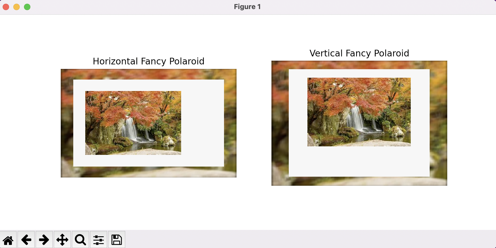

# Polaroid
Creates a Fancy polaroid of the image you provide

Steps to create your own fancy polaroid:
1. Clone the repository to your device
2. Open your terminal.
3. Type in the command ```python3 polaroid.py [your image path]```
4. You get your own 2 fancy polaroid pictures downloaded in the directory!

Results:

<h3>Original Image</h3>


<h3> Results </h3>

